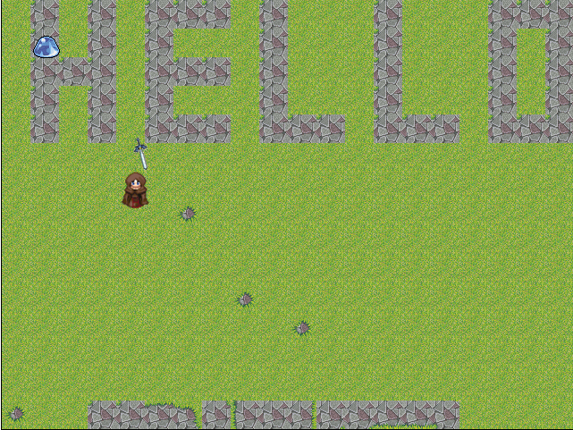

<h1>An old project I begin to crate a RPG</h1>

<h2>Description</h2>

This was a first try to write and understand video games mechanics before starting UE4, and MonoGame (XNA successor, similar to what I used for this beginning, but write in C#).

You will see a tilemap, a character, a slime and a sword. You can move the character on the map, the camera follows the character, and... that's all. After that I tried UE4 and MonoGame.

<h2>Installation</h2>

To install it, just copy all the files in a webserver, like IIS, WAMP, XAMPP, etc.

